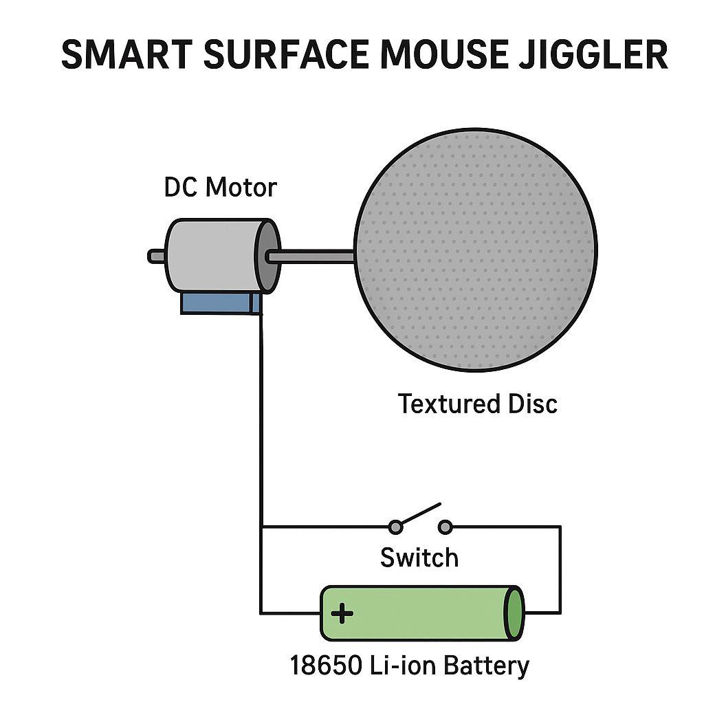
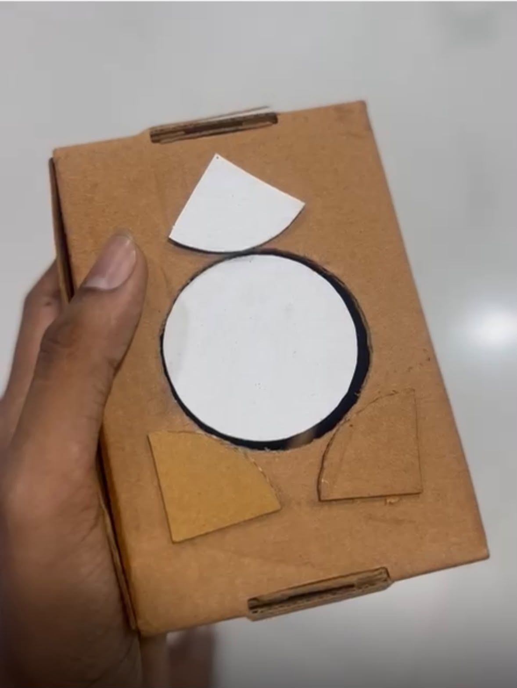
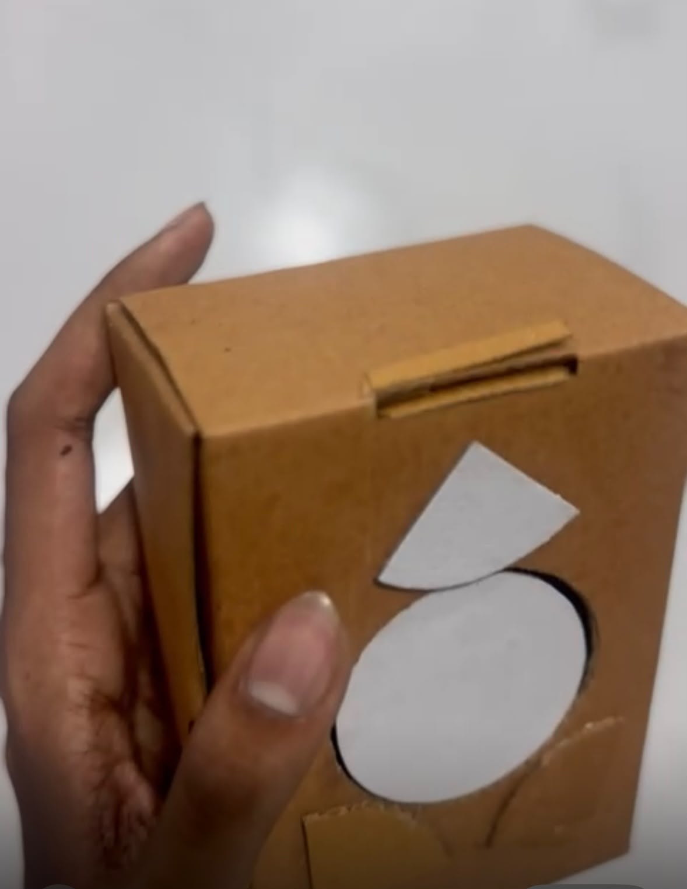
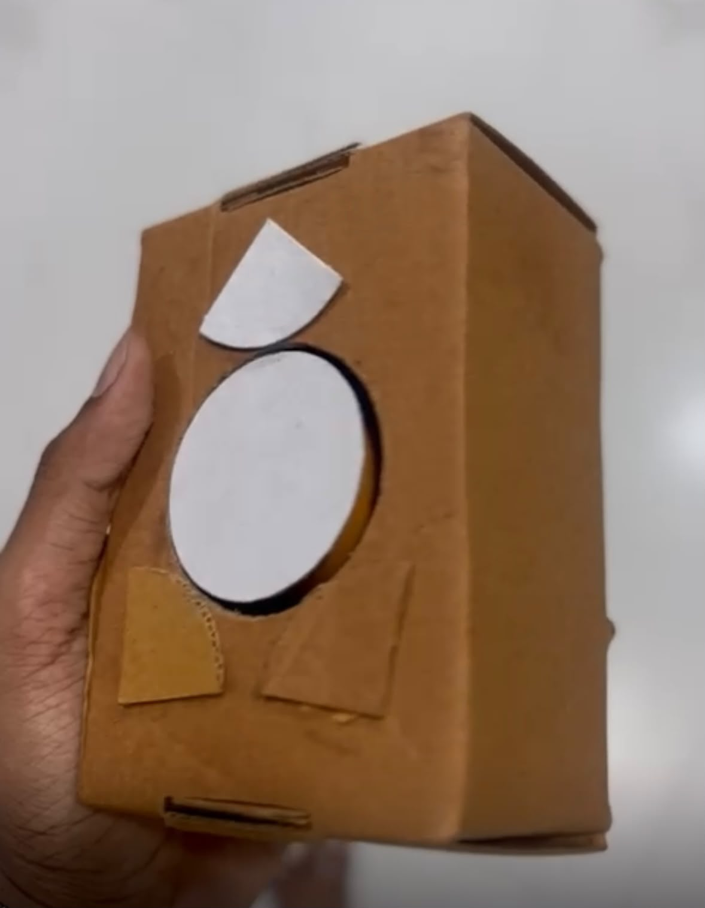
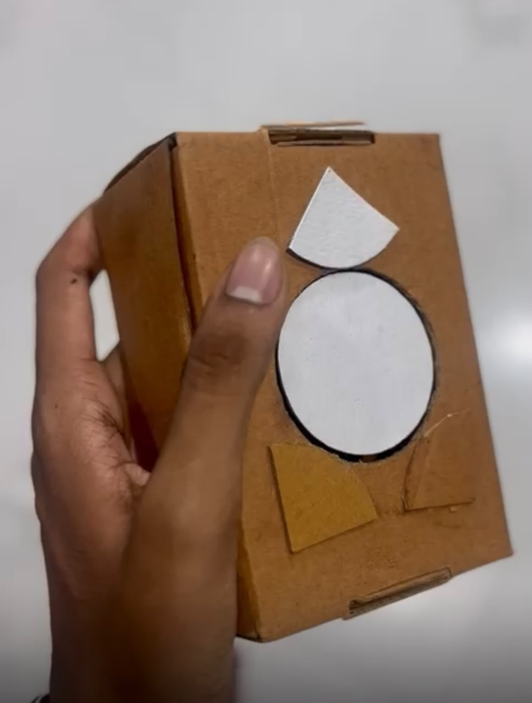

# Smart Surface Mouse Jiggler

A portable, fully mechanical device that keeps a computer awake by simulating continuous mouse movement — no drivers, no USB data connection, no software footprint.


---

## Table of Contents

- [Introduction](#introduction)
- [Features](#features)
- [Motivation](#motivation)
- [Problem Statement](#problem-statement)
- [Objectives](#objectives)
- [Working Principle](#working-principle)
- [System Architecture](#system-architecture)
- [Hardware Components](#hardware-components)
- [Circuit Diagram](#circuit-diagram)
- [Block Diagram](#block-diagram)
- [Simulation](#simulation)
- [Hardware Images](#hardware-images)
- [Results](#results)
- [Applications](#applications)
- [Future Scope](#future-scope)
- [Repository Structure](#repository-structure)
- [Installation](#installation)
- [Usage](#usage)
- [Limitations](#limitations)
- [FAQ](#faq)
- [References](#references)
- [License](#license)
- [Author](#author)

---

## Introduction

The **Smart Surface Mouse Jiggler** is a standalone electromechanical device designed to prevent a computer from entering sleep or idle lock states during long-running, unattended tasks. Unlike software-based jigglers or USB HID emulators, this device performs no data communication with the host machine whatsoever — it physically rotates a textured disc beneath an optical mouse to generate genuine, driver-level movement events.

Because it never touches the USB data lines or installs any code, it is inherently compatible with locked-down corporate environments, security-audited machines, and systems where third-party software or unauthorized USB HID devices are disallowed by policy.

## Features

- 100% mechanical actuation — zero software, zero drivers
- Compatible with any standard optical or laser mouse
- Compact, portable, desk-friendly footprint
- Single ON/OFF switch operation
- Rechargeable 18650 Li-ion power source
- Silent, low-vibration DC gear motor
- No USB data connection required
- Simple, serviceable, low-cost bill of materials

## Motivation

During long compilation jobs, simulations, remote desktop sessions, and unattended monitoring tasks, operating systems frequently trigger sleep or screen-lock states that interrupt active work or disconnect remote sessions. Existing fixes — power settings, software jigglers, or USB HID emulators — are often blocked by IT security policy or are inconvenient to configure repeatedly. A simple, physical, install-free solution addresses this gap directly.

## Problem Statement

Many computers automatically enter sleep mode during long-running tasks such as software compilation, simulations, rendering, large file downloads, laboratory data logging, and automated test runs. Software-based or USB-emulated solutions are frequently blocked by enterprise security policies that restrict driver installation or unauthorized HID devices. A standalone mechanical solution is therefore required — one that requires no software, no drivers, and no data-level access to the host machine.

## Objectives

- Prevent computer sleep/idle lock without any software installation
- Achieve fully mechanical, driver-independent operation
- Keep the design compact and portable
- Minimize power consumption for extended battery life
- Ensure silent, low-vibration operation suitable for office environments
- Maximize battery backup per charge cycle
- Guarantee compatibility with any standard optical mouse

## Working Principle

1. An 18650 Li-ion battery supplies power through a single ON/OFF toggle switch.
2. Closing the switch energizes a low-speed DC gear motor.
3. The motor shaft drives a textured rotating disc.
4. An optical mouse is placed on top of the disc with its sensor facing down.
5. The continuous, low-amplitude surface motion is picked up by the mouse's optical sensor as genuine cursor movement.
6. The host operating system registers continuous input activity and never triggers its idle/sleep timer.

No electrical or data connection exists between the jiggler and the host computer — the interaction is purely optical and mechanical.

## System Architecture

```
 ┌────────────────┐      ┌───────────────┐      ┌──────────────────┐
 │  18650 Battery │ ───► │  ON/OFF Switch│ ───► │   DC Gear Motor   │
 └────────────────┘      └───────────────┘      └─────────┬─────────┘
                                                            │
                                                            ▼
                                                 ┌──────────────────────┐
                                                  Textured Rotating Disc
                                                 └──────────┬───────────┘
                                                            │ (optical motion)
                                                            ▼
                                                 ┌──────────────────────┐
                                                  Optical Mouse Sensor
                                                 └──────────┬───────────┘
                                                            │ (standard HID)
                                                            ▼
                                                 ┌──────────────────────┐
                                                  Host Computer (Active)
                                                 └──────────────────────┘
```

## Hardware Components

| Component | Purpose |
|---|---|
| 18650 Li-ion Battery | Primary power source |
| Battery Holder | Mechanical retention and terminal contact |
| DC Gear Motor (low RPM) | Drives the rotating disc |
| ON/OFF Switch | Power control |
| Connecting Wires | Electrical interconnects |
| Rotating Disc (textured) | Generates optical motion under the mouse sensor |
| Enclosure | Structural housing and protection |

See [`hardware/Components_List.md`](hardware/Components_List.md) and [`hardware/Bill_of_Materials.md`](hardware/Bill_of_Materials.md) for full specifications and sourcing details.

## Circuit Diagram


Full schematic breakdown available in [`hardware/Circuit_Diagram.md`](hardware/Circuit_Diagram.md).

## Block Diagram


Full block-level breakdown available in [`hardware/Block_Diagram.md`](hardware/Block_Diagram.md).

## Simulation



Pre-build simulation notes and motor behavior validation are documented in [`docs/Design_Explanation.md`](docs/Design_Explanation.md).

## Hardware Images






## Results

The prototype reliably prevented sleep/idle activation across all tested operating systems during multi-hour trial runs, with no false negatives observed once disc texture and motor speed were tuned. Full test data, methodology, and pass/fail criteria are recorded in [`docs/Testing_Report.md`](docs/Testing_Report.md).

## Applications

- Long-running simulations and batch jobs
- Software compilation and build pipelines
- Remote desktop / remote access sessions
- Large file transfers and downloads
- Server and infrastructure monitoring dashboards
- Accessibility support for users with limited mobility
- Unattended automation and test rigs
- Laboratory data-logging experiments

## Future Scope

- PWM-based adjustable rotation speed controller
- TP4056 module for safe USB-C battery charging
- 3D-printed enclosure for a finished, production-like look
- LED status/battery indicators
- Battery percentage/charge-level readout
- Automatic mouse-presence detection
- Rubber anti-slip base surface

## Repository Structure

See [`PROJECT_STRUCTURE.md`](PROJECT_STRUCTURE.md) for the full annotated directory tree.

## Installation

This is a hardware project — there is no software to install. Refer to:

- [`hardware/Bill_of_Materials.md`](hardware/Bill_of_Materials.md) for sourcing components
- [`docs/Assembly_Guide.md`](docs/Assembly_Guide.md) for step-by-step build instructions
- [`hardware/Wiring_Guide.md`](hardware/Wiring_Guide.md) for wiring connections

## Usage

1. Assemble the device following the [Assembly Guide](docs/Assembly_Guide.md).
2. Place the device on a flat, stable surface.
3. Position any standard optical mouse on top of the rotating disc, sensor facing down.
4. Flip the ON/OFF switch to power the motor.
5. The mouse will report continuous motion, keeping the host system awake.
6. Flip the switch OFF when no longer needed to conserve battery.

## Limitations

- Requires an optical (not purely mechanical ball) mouse to function
- Battery life is finite and depends on motor load and disc friction
- Not suitable for systems that lock based on keyboard activity alone
- Current revision has no adjustable speed control (see Future Scope)

Full discussion in [`docs/Technical_Documentation.md`](docs/Technical_Documentation.md).

## FAQ

**Does this require any software or drivers?**
No. The device is 100% mechanical and communicates with the host only through the mouse's own standard HID interface.

**Will this work with a wireless mouse?**
Yes, as long as the mouse uses optical/laser sensing and can be physically placed on the rotating disc.

**Does this bypass BIOS or OS-level security features?**
No. It only prevents idle-timeout-triggered sleep by generating legitimate physical mouse motion, identical to a user brushing the mouse.

**How long does the battery last?**
See measured runtime figures in [`docs/Testing_Report.md`](docs/Testing_Report.md).

**Can I 3D print the enclosure?**
Yes — this is listed under [Future Scope](#future-scope) and is compatible with standard FDM printing.

## References

See [`docs/References.md`](docs/References.md) for datasheets, standards, and further reading.

## License

This project is licensed under the MIT License — see [`LICENSE`](LICENSE) for details.

## Author

Maintained by the project author. Contributions are welcome — see [`CONTRIBUTING.md`](CONTRIBUTING.md).
