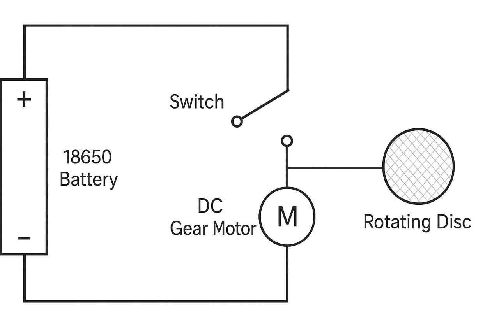

# Block Diagram



## System-Level Block Diagram

```
┌───────────────┐     ┌───────────────┐     ┌────────────────┐
│ Power Source   │────▶│ Control Switch │────▶│  Actuation      │
│ (18650 Battery)│     │  (ON/OFF)      │     │  (DC Gear Motor)│
└───────────────┘     └───────────────┘     └───────┬─────────┘
                                                       │
                                                       ▼
                                            ┌────────────────────┐
                                             Mechanical Transfer
                                             (Rotating Textured
                                                    Disc)
                                            └──────────┬─────────┘
                                                        │
                                                        ▼
                                            ┌────────────────────┐
                                             Sensor Interface
                                             (Host's Optical Mouse)
                                            └──────────┬─────────┘
                                                        │
                                                        ▼
                                            ┌────────────────────┐
                                             Host Computer
                                             (Sleep Prevention)
                                            └────────────────────┘
```

## Block Descriptions

| Block | Function |
|---|---|
| Power Source | Supplies 3.7V nominal DC to the system |
| Control Switch | User-operated ON/OFF gate for the entire circuit |
| Actuation | Converts electrical energy into rotational mechanical motion |
| Mechanical Transfer | Translates motor rotation into a moving textured surface |
| Sensor Interface | The user's own optical mouse, unmodified, resting on the disc |
| Host Computer | Receives standard HID movement events and remains active |

## Interface Boundaries

The only interface between this device and the host computer is **optical**, through the mouse's own sensor. There is no electrical, USB, or data-level connection between the jiggler and the host system, which is the defining architectural decision of this project.
