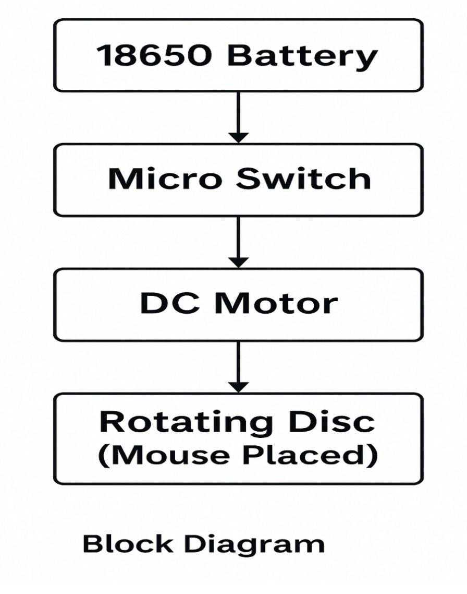

# Circuit Diagram



## Schematic Overview

The circuit is a simple series loop with three elements: power source, switch, and motor.

```
   +----------------+       +---------------+       +------------------+
   |  18650 Battery |-------|  SPST Switch  |-------|  DC Gear Motor   |
   |     (3.7V)     |       |   (ON/OFF)    |       |    (M)           |
   +--------+-------+       +---------------+       +---------+--------+
            |                                                  |
            +--------------------------------------------------+
                              (Ground / Return Path)
```

## Net List

| Net | From | To |
|---|---|---|
| Net 1 | Battery (+) | Switch Terminal A |
| Net 2 | Switch Terminal B | Motor (+) |
| Net 3 | Motor (-) | Battery (-) |

## Design Notes

- No flyback diode is required for this application since the motor is not driven by a switching transistor; it is a direct mechanical switch connection.
- No current-limiting resistor is required, as the DC gear motor's internal winding resistance limits current to a safe range within the battery's rated discharge capability.
- Future revisions incorporating PWM speed control (see [`docs/Future_Improvements.md`](../docs/Future_Improvements.md)) will require a flyback diode across the motor terminals to protect the switching transistor from back-EMF.

## Polarity Warning

Always verify battery and motor polarity before final assembly. Reversed polarity will cause the motor to spin in the reverse direction, which does not damage the circuit but may affect disc orientation relative to enclosure design.
